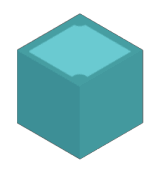
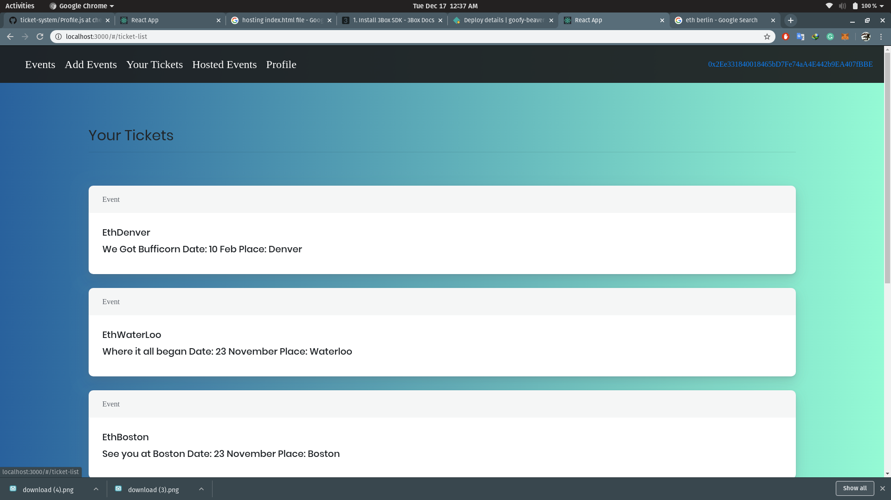
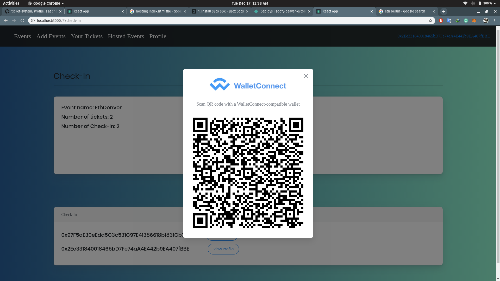
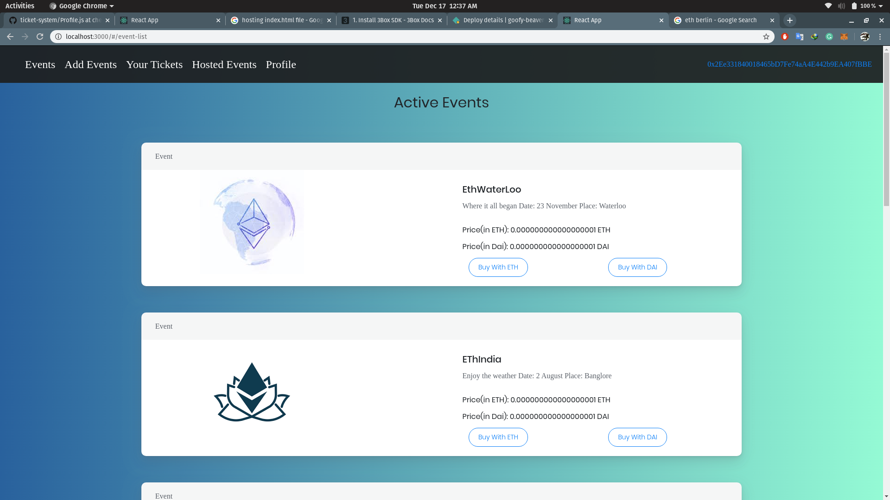
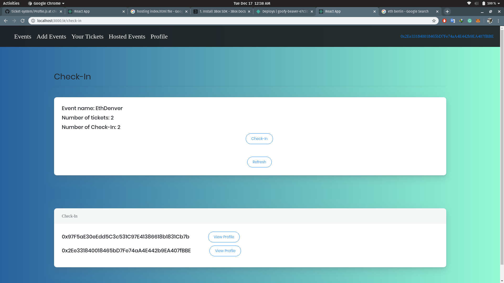

# Tickets On Chain
A decentralized Platform for all your Events. 
Please Use Kovan testnet.
## About Project
This project is Ehtereum based event hosting platform, it utilizes WalletConnect for check in, 3BOX for profile management, IPFS for files hosting and web3connect for managing Web3 Provider. 
</t>             </t>         
## Features of Project 
1. Easy Payments for tickets using ETH or DAI.
2. Decentralized management of Profile using 3BOX.
3. Event Hosts can check profiles of ticket holders.
4. If some ticket holders did not configure his profile, Event host can still see all the events hosted and tickets held by ticket holder.
5. Event host can set maximum number of ticket to be sold.
6. Event host can also disable an event to stop more ticket purchases.
7. Users can view tickets held by them(tickets are NFTs).
8. Users have choice whether to add information to their profile or not.
9. This Dapp supports three methods of using web3, Metamask, Torus and WalletConnect.
10. Check-In is done using Wallet Connect, attendee scans qr code using WalletConnect enabled wallet and confirms an transaction.
11. All the images of events are hosted on IPFS.
## Tech Stack
1. React - Used for Buidling Dapp.
2. WalletConnect - For Checking in and web3 Provider.
3. Web3Connect - Enabled support for multiple Web3 Provider.
4. 3BOX - Used For Identity and profile management of Users.
## Some Remarks
1. Please Refrain from using Exceptional Values, proper exceptional Handeling is yet to be added.
2. For Testing you can use given private key - `6AD90A424022BE35F9A95AE44143DB08C894BA44ED0DE90B67199288E06924D5` This will allow you to test the Dapp better, you wont have to add event or anything.
3. This Dapp is relys on kovan, thus please switch to kovan before Using Dapp.
4. If something goes wrong please ping me on telegram, my user name is `abhimanyu121`.
5. This was our first Dapp and website, thus it might have some rough edges here and there.
6. This Dapp is hosted [here](goofy-beaver-e7c5b4.netlify.com)
## Running Development server
1. Install all the dependencies with `npm install`.
2. Run Development server with `npm start`.
## Some Screenshots
||
||

## Future Roadmaps
1. Deployment to Mainnet.
2. Adding Support for more ERC20 tokens.
3. Dynamic Pricing to mitigate effect of fluctuating price of eth.
4. Adding Support for multiple event admins.
5. Optimizing Ui and Ux.
